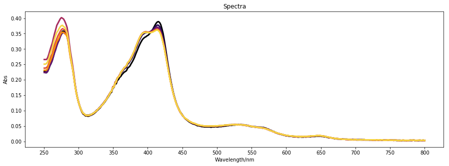
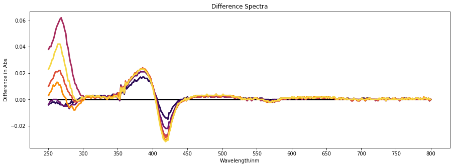
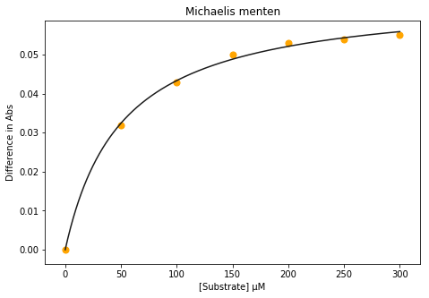
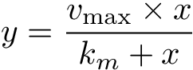

# Data-Handling-tools

Some of my tools for data as comes off the machines
# [UV-Vis Spectrometer data analysis and plotting](https://github.com/jamesengleback/Data-Handling-tools/blob/master/20180623%20-%20Varian%20Spec%20data.ipynb)
This was a notebook I used to process [UV-Vis](https://en.wikipedia.org/wiki/Ultraviolet%E2%80%93visible_spectroscopy) data from [titration](https://www.ncbi.nlm.nih.gov/pmc/articles/PMC4756639/) experiments on [P450 Enzymes](https://en.wikipedia.org/wiki/Cytochrome_P450), which is what [my lab](https://www.research.manchester.ac.uk/portal/andrew.munro.html) work on. 
The .csv files that are generated by our spectrometers need some wrangling, which I did using [pandas](https://pandas.pydata.org/), then there are a few [pyplot](https://matplotlib.org/api/pyplot_api.html) plots:
The absorbance between 200 and 800 nm for my [P450](https://www.ncbi.nlm.nih.gov/pubmed/12076537) as it sits in a [cuvette](https://en.wikipedia.org/wiki/Cuvette) and I add increments of a [compound it binds with](https://pubchem.ncbi.nlm.nih.gov/compound/Fluazifop). (Sorry for not doing a colormap! It's on my list)

To get a better look at how the [absorption profile](https://www.ncbi.nlm.nih.gov/pmc/articles/PMC3041835/) changes as compound is added, we subtract the first (compound-free) profile from all of the other traces. Check it out:

The Differences in absorbance at around 280 nm I think are a result of is known as [funny business](https://en.wikipedia.org/wiki/Absorption_spectroscopy), so I'm ignoring them for now. We're interested in the changes at around 390 and 420 nm, which is where the enzyme's [heme](https://en.wikipedia.org/wiki/Heme) attachment shifts its absorbance profile in [response to binding to a compound](https://www.ncbi.nlm.nih.gov/pmc/articles/PMC3041835/).

If we plot how much the absorbance changes at 390 and 420 nm in response to adding my compound we get this:

This [Michaelis-Menten saturation curve ](https://en.wikipedia.org/wiki/Michaelis%E2%80%93Menten_kinetics) was fit to the data points by parameterising the Michaelis Menten equation:

Where x is the concentration of the compound, y is the change in absorbance in response to that, and we want to work out the two constants, vmax and kd. I'm using the curve fitting fuction in [Scipy](https://www.scipy.org/) to minimise the R^2 of my model.
The [K_m](https://en.wikipedia.org/wiki/Dissociation_constant) metric is a fairly typical measure of how tight a compound binds to an enzyme, where lower means tighter bound. In this case, my [compound](https://pubchem.ncbi.nlm.nih.gov/compound/Fluazifop) bound with a K_d of about 50 uM, which is relatively promising if we want to engineer this enzyme to break it down (we don't right now).
